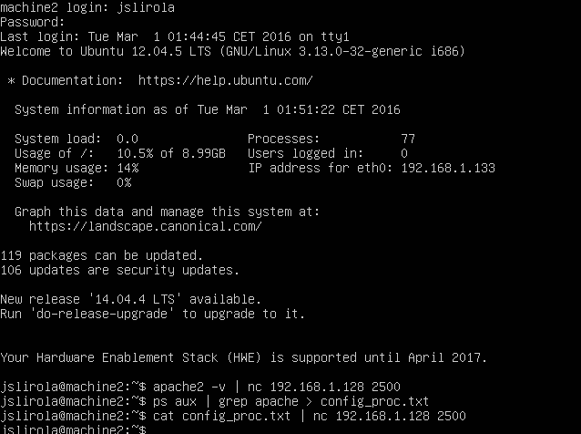

## Práctica 1

Máquina virtual: **machine1**

```bash
jslirola@machine1:~$ apache -v
Server version: Apache/2.2.22 (Ubuntu
Server built:   Jul 22 2014 14:37:02

jslirola@machine1:~$ ps aux | grep apache
root      1071  0.0  1.3  34044  6900 ?        Ss   01:43   0:00 /usr/sbin/apache2 -k start
www-data  1116  0.0  0.7  34068  3768 ?        S    01:43   0:00 /usr/sbin/apache2 -k start
www-data  1117  0.0  0.7  34068  3768 ?        S    01:43   0:00 /usr/sbin/apache2 -k start
www-data  1118  0.0  0.7  34068  3768 ?        S    01:43   0:00 /usr/sbin/apache2 -k start
www-data  1119  0.0  0.7  34068  3768 ?        S    01:43   0:00 /usr/sbin/apache2 -k start
www-data  1120  0.0  0.7  34068  3768 ?        S    01:43   0:00 /usr/sbin/apache2 -k start
jslirola  1463  0.0  0.1   4388   828 tty1     S+   01:50   0:00 grep --color=auto apache
```

Máquina virtual: **machine2**

```bash
jslirola@machine2:~$ apache -v
Server version: Apache/2.2.22 (Ubuntu
Server built:   Jul 22 2014 14:37:02

jslirola@machine2:~$ ps aux | grep apache
root      1035  0.0  1.3  34044  6896 ?        Ss   01:45   0:00 /usr/sbin/apache2 -k start
www-data  1080  0.0  0.7  34068  3764 ?        S    01:45   0:00 /usr/sbin/apache2 -k start
www-data  1081  0.0  0.7  34068  3764 ?        S    01:45   0:00 /usr/sbin/apache2 -k start
www-data  1082  0.0  0.7  34068  3764 ?        S    01:45   0:00 /usr/sbin/apache2 -k start
www-data  1083  0.0  0.7  34068  3764 ?        S    01:45   0:00 /usr/sbin/apache2 -k start
www-data  1084  0.0  0.7  34068  3764 ?        S    01:45   0:00 /usr/sbin/apache2 -k start
jslirola  1414  0.0  0.1   4388   828 tty1     S+   01:52   0:00 grep --color=auto apache
```

Se ha utilizado la herramienta *[netcat](https://en.wikipedia.org/wiki/Netcat)* para transferir la información de las máquinas virtuales a la anfitrión como se puede apreciar en la siguiente captura de pantalla.


