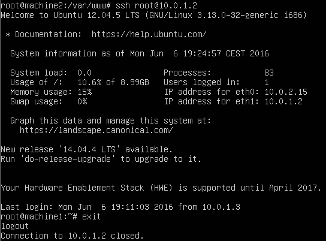

## Práctica 2

Instalamos la herramienta rsync en cada una de las máquinas virtuales y probamos el clonado de directorios:


Generamos la clave pública SSH de la segunda máquina a la primera con `ssh-keygen -t dsa` dejando en blanco la 'passphrase' y la copiamos con `ssh-copy-id -i .ssh/id_dsa.pub root@10.0.1.2`

Si todo ha ido bien nos conectaremos sin necesidad de contraseña: 



Por último vamos a programar una tarea que automatice el proceso de backups entre las dos máquinas

```bash
root@machine2:~# vim /etc/crontab

# /etc/crontab: system-wide crontab.....

SHELL=/bin/sh
PATH=/usr/local/sbin:/usr/local/bin:/sbin:/bin:/usr/sbin:/usr/bin

# m h dom mon dow user command
01 * * * * root rsync -avz -e ssh root@10.0.1.2:/var/www/ /var/www
#
```

