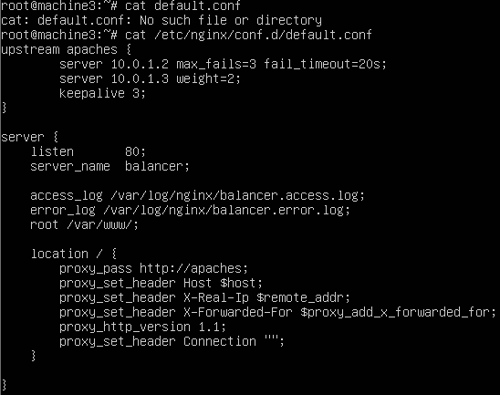
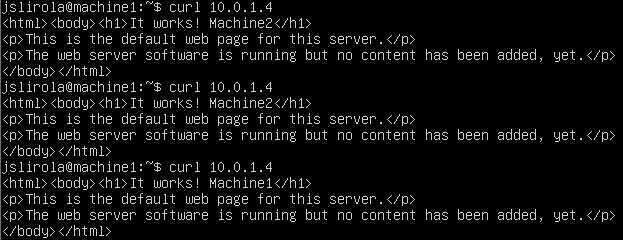
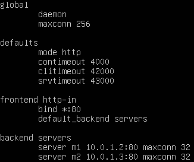
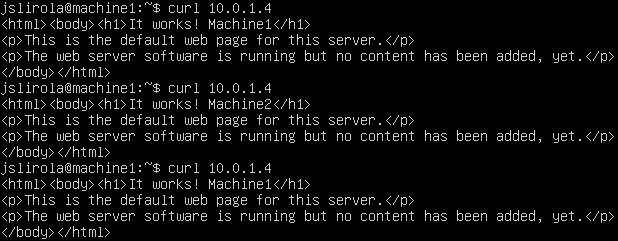

## Práctica 3 - Balanceo de carga en una granja web

Lo primero que necesitamos en configurar una nueva máquina virtual (machine3) y asegurarnos que el puerto 80 no está siendo utilizado, en caso de tener instalado apache podemos eliminar el demonio del arranque con el siguiente comando (Ubuntu/Debian):

```
update-rc.d -f apache2 remove
```

Ahora pasemos a la instalación del servidor Nginx sobre ésta:

```bash
cd /tmp/
wget http://nginx.org/keys/nginx_signing.key
apt-key add /tmp/nginx_signing.key
rm -f /tmp/nginx_signing.key

echo "deb http://nginx.org/packages/ubuntu/ lucid nginx" >> /etc/apt/sources.list
echo "deb-src http://nginx.org/packages/ubuntu/ lucid nginx" >> /etc/apt/sources.list

apt-get update
apt-get install nginx
```

Podemos comprobar que se ha instalado mostrando la versión:

```bash
root@machine3:/tmp# nginx -v
nginx version: nginx/1.8.0
```

Pasemos a su configuración modificando el fichero `/etc/nginx/conf.d/default.conf`:



Guardamos los cambios y reiniciamos el servicio.

```bash
root@machine3:~# service nginx restart;
 * Restarting nginx nginx						[ OK ]
```

Para comprobar que funciona correctamente realizamos peticiones sobre la ip del balanceador, es decir ésta misma máquina:



Detenemos el servicio para probar otro balanceador y no interferir en el uso del mismo puerto: `service nginx stop`

Instalamos haproxy y lo configuramos:

```bash
apt-get install haproxy
vim /etc/haproxy/haproxy.cfg
```



Lanzamos el servicio con `/usr/sbin/haproxy -f /etc/haproxy/haproxy.cfg` y testeamos el balanceador como hemos hecho anteriormente:



[**Siguiente práctica**](../Practica4/P4.md)