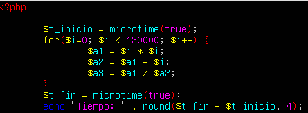
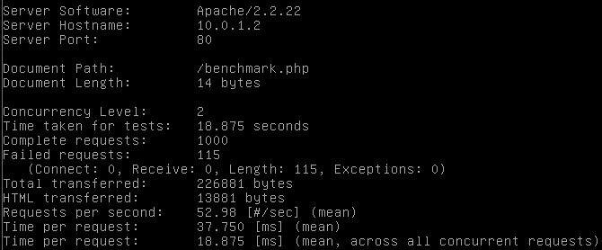
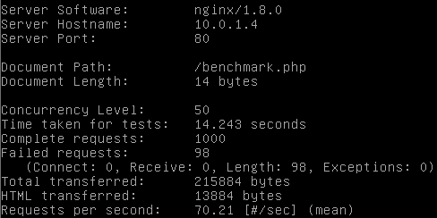
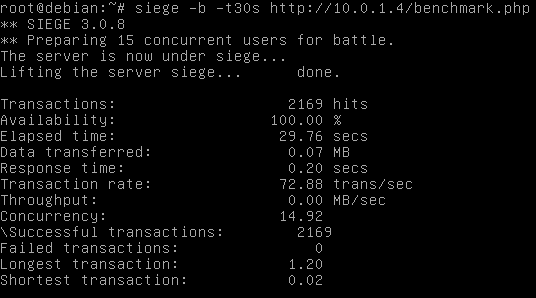

## Práctica 4 - Evaluación de prestaciones

Rendimiento de los servidores aplicando tests de estrés sobre ellos. Para aumentar los tiempos de respuesta se ha programado un pequeño snippet de código en php (benchmark.php):



Los tests se ejecutarán desde otra máquina independiente pero en la misma red interna, un Debian 8 para ser exactos:

Empecemos con Apache Benchmark sobre la máquina 1:

```
root@debian:~# ab -n 1000 -c 10 http://10.0.1.2/benchmark.php | less
```

|   		| Tiempo | Solicitudes fallidas | Solicitudes por segundo |
|:-:		|:-:	 |:-:					|:-:	|
| Test 1	| 19.020 | 113 					| 52.58	|
| Test 2	| 18.941 | 98  					| 52.80	|
| Test 3	| 18.967 | 106  				| 52.72	|
| Test 4	| 18.822 | 94  					| 53.13	|
| Test 5	| 18.751 | 89  					| 53.33	|
| Test 6	| 18.957 | 96  					| 52.75	|
| Test 7	| 18.956 | 99  					| 52.75	|
| Test 8	| 20.258 | 90  					| 49.36	|
| Test 9	| 18.875 | 115  				| 52.98	|
| Test 10	| 19.707 | 151  				| 50.74	|
| Media		| 19.1244| 105.1  				| 52.114|
| D. típica	| -		 | -	  				| -		|

Vista previa de una de las ejecuciones:



Apache Benchmark sobre el balanceador con Nginx:

```
root@debian:~# ab -n 1000 -c 10 http://10.0.1.4/benchmark.php | less
```

|   		| Tiempo | Solicitudes fallidas | Solicitudes por segundo |
|:-:		|:-:	 |:-:					|:-:	|
| Test 1	| 14.243 | 98 					| 70.21	|
| Test 2	| 14.885 | 105 					| 72.51	|
| Test 3	| 13.276 | 122  				| 75.32	|
| Test 4	| 14.295 | 111  				| 69.95	|
| Test 5	| 13.194 | 106  				| 75.79	|
| Test 6	| 13.359 | 102  				| 74.86	|
| Test 7	| 14.169 | 111  				| 70.58	|
| Test 8	| 13.322 | 90  					| 75.07	|
| Test 9	| 13.680 | 99  					| 73.10	|
| Test 10	| 13.371 | 99  					| 74.79	|
| Media		| -		 | -  					| -		|
| D. típica	| -		 | -	  				| -		|

Vista previa de una de las ejecuciones:



Apache Benchmark sobre el balanceador con Haproxy:

```
root@debian:~# ab -n 1000 -c 10 http://10.0.1.4/benchmark.php | less
```

|   		| Tiempo | Solicitudes fallidas | Solicitudes por segundo |
|:-:		|:-:	 |:-:					|:-:	|
| Test 1	| 11.896 | 92 					| 84.06	|
| Test 2	| 11.120 | 100  				| 80.76	|
| Test 3	| 12.383 | 87  					| 82.70	|
| Test 4	| 11.704 | 90  					| 85.44	|
| Test 5	| 10.495 | 90  					| 95.29	|
| Test 6	| 10.488 | 97  					| 95.35	|
| Test 7	| 11.184 | 104  				| 89.42	|
| Test 8	| 10.394 | 109  				| 96.21	|
| Test 9	| 10.635 | 100  				| 94.03	|
| Test 10	| 11.094 | 107  				| 90.14	|
| Media		| 11.139 | 97.6	  				| 89.34	|
| D. típica	| -		 | -	  				| -		|

Siege sobre la máquina 1:

```
root@debian:~# siege -b -t30s http://10.0.1.2/benchmark.php
```

|   		| Disponibilidad | T. respuesta | Solicitudes por segundo | S. fallidas |
|:-:		|:-:	 		 |:-:			|:-:		   			  |:-:		  	|
| Test 1	| 100			 | 0.29			| 50.73		   			  | 0		  	|
| Test 2	| 100		 	 | 0.29			| 51.78		   			  | 0		  	|
| Test 3	| 100		 	 | 0.29			| 51.97		   			  | 0		  	|
| Test 4	| 100			 | 0.29			| 50.95		   			  | 0		  	|
| Test 5	| 100			 | 0.29			| 51.37		   			  | 0		  	|
| Test 6	| 100			 | 0.29			| 51.38		   			  | 0		  	|
| Test 7	| 100			 | 0.29			| 51.85	   			  	  | 0		  	|
| Test 8	| 100			 | 0.29			| 51.76	   			  	  | 0		  	|
| Test 9	| 100			 | 0.29			| 51.77	   			  	  | 0		  	|
| Test 10	| 100			 | 0.30			| 49.73	   			  	  | 0		  	|
| Media		| 100		 	 | 0.291		| 51,328   			  	  | 0		  	|
| D. típica	| -			 	 | -			| -		   			  	  | -		  	|

Siege sobre el balanceador con Nginx:

```
root@debian:~# siege -b -t30s http://10.0.1.4/benchmark.php
```

|   		| Disponibilidad | T. respuesta | Solicitudes por segundo | S. fallidas |
|:-:		|:-:	 		 |:-:			|:-:		   			  |:-:		  	|
| Test 1	| 100			 | 0.20			| 72.88		   			  | 0		  	|
| Test 2	| 100			 | 0.22			| 66.56		   			  | 0		  	|
| Test 3	| 100			 | 0.22			| 68.39		   			  | 0		  	|
| Test 4	| 100   	 	 | 0.20			| 76.11		   			  | 0		  	|
| Test 5	| 100   	 	 | 0.22			| 67.36		   			  | 0		  	|
| Test 6	| 100   	 	 | 0.20			| 73.27		   			  | 0		  	|
| Test 7	| 100   	 	 | 0.21			| 69.68		   			  | 0		  	|
| Test 8	| 100   	 	 | 0.24			| 62.90		   			  | 0		  	|
| Test 9	| 100   	 	 | 0.21			| 72.49 		 		  | 0		  	|
| Test 10	| 100   	 	 | 0.20			| 76.02		   			  | 0		  	|
| Media		| 100   	 	 | 0.212		| 70.566	   			  | 0		  	|
| D. típica	| -			 	 | -			| -		   			  	  | -		  	|

Vista previa de una de las ejecuciones:



Siege sobre el balanceador con Haproxy:

```
root@debian:~# siege -b -t30s http://10.0.1.4/benchmark.php
```

|   		| Disponibilidad | T. respuesta | Solicitudes por segundo | S. fallidas |
|:-:		|:-:	 		 |:-:			|:-:		   			  |:-:		  	|
| Test 1	| 100			 | 0.16			| 92.13		   			  | 0		  	|
| Test 2	| 100			 | 0.16			| 92.40		   			  | 0		  	|
| Test 3	| 100			 | 0.17			| 88.61		   			  | 0		  	|
| Test 4	| 100   	 	 | 0.16			| 93.40		   			  | 0		  	|
| Test 5	| 100   	 	 | 0.16			| 92.32		   			  | 0		  	|
| Test 6	| 100   	 	 | 0.17			| 86.46		   			  | 0		  	|
| Test 7	| 100   	 	 | 0.16			| 93.57		   			  | 0		  	|
| Test 8	| 100   	 	 | 0.16			| 91.16		   			  | 0		  	|
| Test 9	| 100   	 	 | 0.17			| 86.83 		 		  | 0		  	|
| Test 10	| 100   	 	 | 0.16			| 92.30		   			  | 0		  	|
| Media		| 100   	 	 | 0.163		| 90.918	   			  | 0		  	|
| D. típica	| -			 	 | -			| -		   			  	  | -		  	|