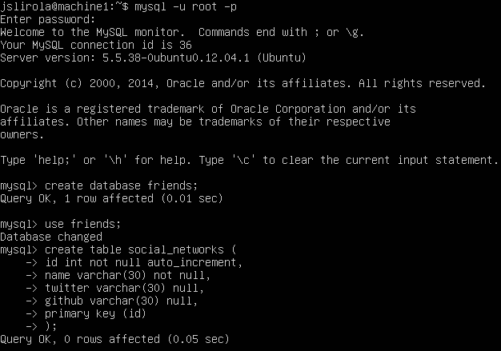
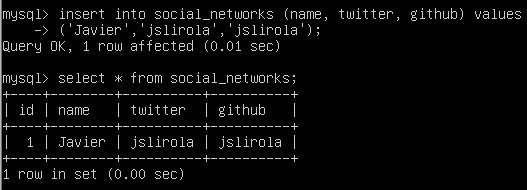
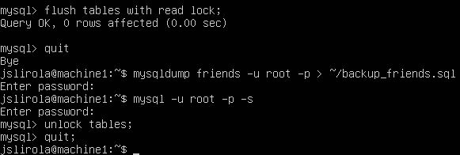
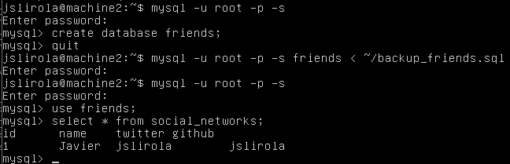
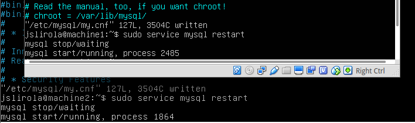
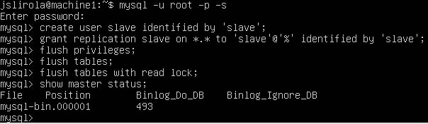
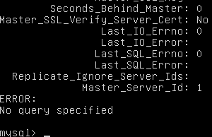
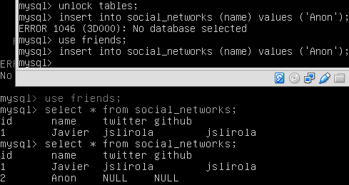

## Práctica 5 - Replicación de bases de datos maestro-esclavos

En esta práctica se dispondrá de un servidor de backup para nuestras bases de datos MySQL, empecemos creando la base de datos de prueba en nuestra máquina 1, que será la que adoptará el rol de 'maestro' en la configuración 'maestro-esclavo'.



El siguiente paso consiste en insertar datos y realizar un backup para volcar manualmente en nuestro servidor 'esclavo', la máquina 2.



Usamos la herramienta *mysqldump* para realizar el backup y exportar las sentencias SQL a un fichero, es importante bloquear las tablas antes de realizar este paso para evitar futuros errores:



La ejecución de mysql se ha iniciado en modo 'silencioso' (-s) para evitar mensajes de bienvenida y obtener unas capturas de pantallas más precisas.

Ahora mediante scp copiaremos el fichero exportado a la máquina 'esclavo' y crearemos la base de datos manualmente antes de importar éste.



Ya hemos realizado el proceso de clonado de forma manual, pero lo idóneo es realizarlo automáticamente, por lo que vamos allá:



Editamos los ficheros de configuración de mysql (/etc/mysql/my.cnf), en el maestro nos quedamos con estas líneas en este estado:

```
#bind-address 127.0.0.1
log_error = /var/log/mysql/error.log
server_id = 1
```

En el esclavo es similar exceptuando el identificador del servidor que contendrá el valor 2 en vez de 1. Reiniciamos ambos servidores tras guardar la configuración:

```
sudo service mysql restart
```

Pasamos a crear un usuario en MySQL con permisos para la replicación automática:



Habiendo mostrado el estado del maestro con el comando `show master status' vamos a terminar de configurar el esclavo con esos datos.

```mysql
mysql> CHANGE MASTER TO MASTER_HOST='10.0.1.2',
> MASTER_USER='slave', MASTER_PASSWORD='slave',
> MASTER_LOG_FILE='mysql-bin.000001', MASTER_LOG_POS=493,
> MASTER_PORT=3306;
```

Si todo ha ido bien solo nos queda arrancar el servidor esclavo, y comprobar que funciona correctamente:

```mysql
mysql> start slave;
mysql> show slave status\G;
```

Si el valor de la variable `Seconds_Behind_Master` es distinto de 'null' estará funcionando correctamente.



Para finalizar vamos a verificar que se realiza la replicación automáticamente, desbloqueamos las tablas en el maestro e insertamos un dato, tras ello comprobamos que ha sido copiado al esclavo al instante:

